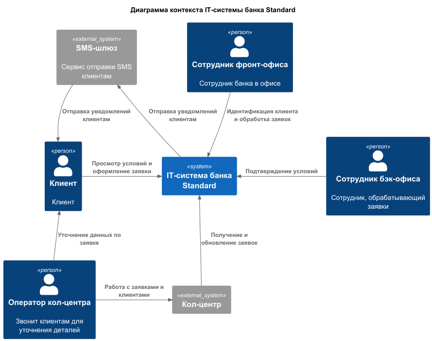
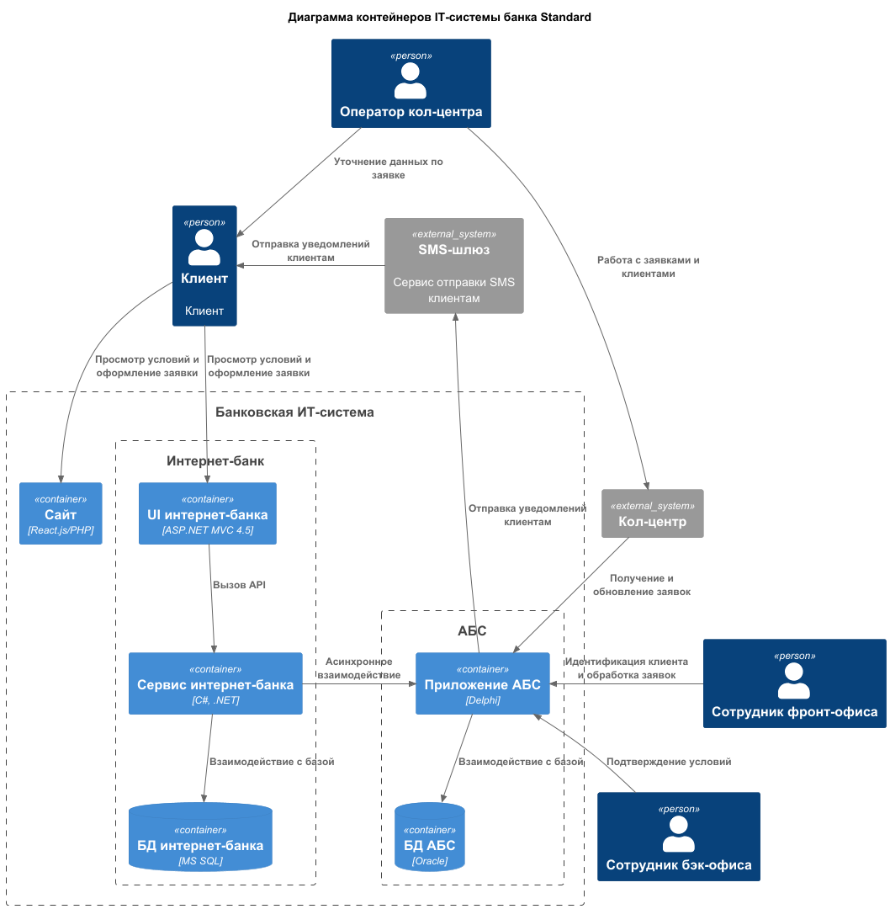

### **Название задачи:** MVP Открытие депозитов онлайн 
### **Автор:** Игорь Барбашов
### **Дата:** 11.08.2025
### **Функциональные требования**

| **№** | **Действующие лица или системы**                                 | **Use Case**                                                                           | **Описание**                                                                                                                                                                                                                                                                                                                     |
|:-----:|:-----------------------------------------------------------------|:---------------------------------------------------------------------------------------|:---------------------------------------------------------------------------------------------------------------------------------------------------------------------------------------------------------------------------------------------------------------------------------------------------------------------------------|
|  1.1  | Новый клиент, оператор кол-центра, сайт, система-кол-центра, АБС | Оформление заявки на депозит через сайт банка                                          | 1. Новый клиент заходит на сайт и видит общие условия по депозитам 2. Новый клиент оформляет заявку на депозит заполнив в форме ФИО и контакты для связи 3. Заявку видит оператор кол-центра и связывается с клиентом для уточнения деталей 4. После выяснения всех деталей оператор кол-центра заводит заявку в АБС |
|  1.2  | Новый клиент, сотрудник фронт-офиса, АБС                         | Идентификация нового клиента в офисе банка, подтверждение заявки                       | 1. Новый клиент приходит в офис банка 2. Сотрудник фронт-офиса видит заявку клиента в АБС 3. Сотрудник фронт-офиса производит идентификацию клиента, заносит в АБС информацию по необходимым документам 4. Сотрудник фронт-офиса проверяет актуальность всех данных в заявке, ставит ей статус "Подтверждена"        |
|   2   | Клиент, интернет-банк, АБС                                       | Оформление заявки в интернет-банке                                                     |1. Клиент заходит в интернет-банк и видит персональные условия по депозитам 2. Клиент оформляет заявку на депозит указав счет и сумму 3. Для подтверждения заявки клиент отправляет код полученный по SMS 4. После подтверждения заявка размещается в АБС со статусом "Подтверждено"| 
|   3   | Клиент, сотрудник бэк-офиса, АБС, sms-шлюз                       | Согласование заявки                                                                    |1. Сотрудник бэк-офиса видит заявку в АБС 2. Сотрудник бэк-офиса подтверждает условия размещения депозита 3. Клиент получает СМС о размещенном депозите

### **Нефункциональные требования**
Опишите здесь нефункциональные требования и архитектурно значимые требования.

| **№** | **Требование**                                                          |
|:-----:|:------------------------------------------------------------------------|
|   1   | Высокая доступность (99,9%)                                             |
|   2   | Шифрование данных / трафика                                             |
|   3   | Горизонтальное масштабирование интернет-банка                           |
|   4   | Вертикальное масштабирование БД АБС                                     |
|   5   | Время ответа на все операции < 1 сек                                    |
|   6   | Использование технологий по которым есть экспертиза                     |
|   7   | Не прямая интеграция интернет-банка и АБС |

### **Решение**
- Для повышения устойчивости интернет-банк развернут на группе серверов в ЦОД (с резервным ЦОД на переключение при сбоях)
- Для минимизации нагрузки на АБС и обеспечения быстрого отклика между интернет-банком и АБС используется асинхронный промежуточный слой

Структура диаграммы контейнеров (C4) для MVP открытия депозитов

1. Интернет-банк
  - Технологии: ASP.NET MVC 4.5, .NET Framework 4.5, MS SQL
  - Функциональность:
    - Отображение персонализированных депозитных продуктов и ставок
    - Подача заявки на депозит с подтверждением через SMS-код
    - Шифрование трафика для защиты данных клиента
    - Взаимодействие с системой АБС для размещения заявок через защищенный асинхронный промежуточный слой
2. АБС
  - Технологии: Delphi-клиент, Oracle БД, PL/SQL
  - Функциональность:
    - Хранение и обработка заявок на депозиты и кредиты
    - Логика согласования ставок и заявок (бэк-офис)
    - Ограниченное взаимодействие с интернет-банком через асинхронный промежуточный слой (без прямых вызовов)
    - Интеграция с SMS-шлюзом
    - Поддержка бэк-офисных процессов и фронт-офисного взаимодействия
3. Сайт банка
  - Технологии: PHP + React.js
  - Функции:
    - Отображение общих условий депозитов и ставок
    - Подача заявки с минимумом информации (Ф.И.О и телефон)
    - Пересылка заявки в систему колл-центра
    - Защищенная передача данных (шифрование)
4. Система колл-центра
  - Технологии: React.js (frontend), Java Spring Boot (backend), PostgreSQL
  - Функции:
    - Обработка заявок с сайта
    - Связь с клиентом и уточнение данных заявки
    - Оформление заявки в АБС для дальнейшей обработки
5. Система партнерского кол-центра (внешняя система)
6. SMS-шлюз телеком-оператора (внешняя система)

### **Альтернативы**
- Прямая интеграция ИБ с АБС - невозможно из-за требований команды АБС
- Kafka для обработки событий - на данный момент не совместим с текущей версией ИБ
- Вынос расчета депозитных ставок в микросервис - нет ресурсов для реализации на данном этапе

### **Недостатки, ограничения, риски**
- АБС ограничена только вертикальным масштабированием
- Отправка СМС зависит от внешнего оператора
- Передача персональных данных по каналам связи требует дополнительных подходов к обеспечению безопасности
- Необходимость избегать прямого взаимодействия с API АБС
- Ручной расчет депозитных ставок