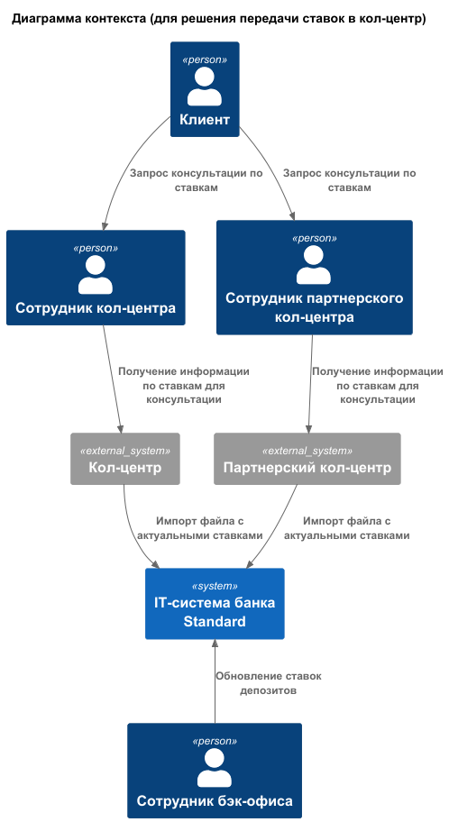
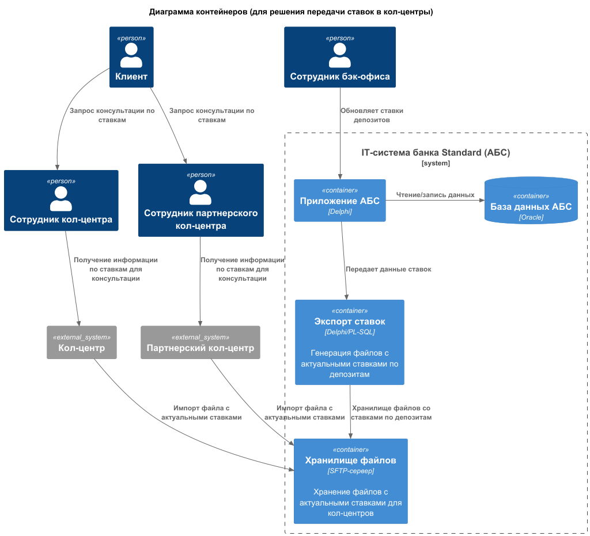
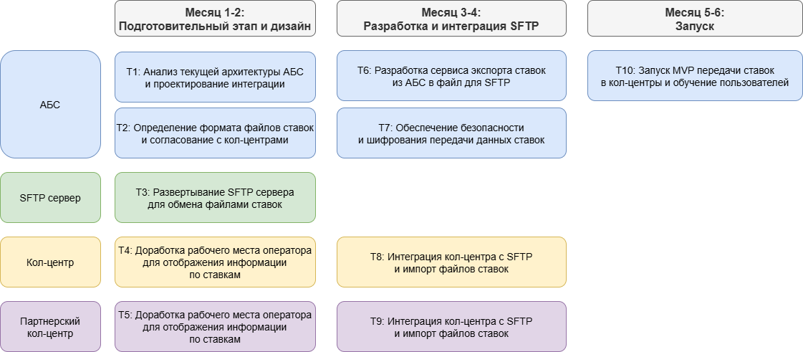

### **Название задачи:** Передача ставок в кол-центр 
### **Автор:** Игорь Барбашов
### **Дата:** 12.08.2025
### **Функциональные требования**
| **№** | **Действующие лица или системы**                                | **Use Case**                                                  | **Описание**                                                                                                                                                                                                 |
|:-----:|:----------------------------------------------------------------|:--------------------------------------------------------------|:-------------------------------------------------------------------------------------------------------------------------------------------------------------------------------------------------------------|
|   1   | Сотрудник бэк-офиса, АБС                                        | Обновление общих ставок по депозитам                          | 1. Сотрудник бэк-офиса рассчитывает новые общие ставки по депозитам 2. Сотрудник бэк-офиса заносит обновленные ставки по депозитам в АБС                                                                 |
|   2   | АБС, система кол-центра                                         | Передача ставок по депозитам в кол-центр                      | 1. АБС передает обновленные ставки по депозитам в систему кол-центра                                                                                                                                         |
|   3   | Клиент, оператор кол-центра, система кол-центра                 | Консультирование клиентов по ставкам                          | 1. Клиент обращается в кол-центр за информацией по депозитам 2. Оператор кол-центра имеет доступ к актуальным ставкам по депозитам и может проконсультировать клиента                                    |
|   4   | АБС, партнерский кол-центр                                      | Передача ставок по депозитам партнерскому кол-центру          | 1. АБС ежесуточно после обновления экспортирует в хранилище файл с актуальными ставками по депозитам 2. Партнерский кол-центр через SFTP может загрузить файлы с обновленными ставками по депозитам      |
|   5   | Клиент, оператор партнерского кол-центра, партнерский кол-центр | Консультирование клиентов операторами партнерского кол-центра | 1. Клиент обращается в партнерский кол-центр за информацией по депозитам 2. Оператор партнерского кол-центра имеет доступ к файлу с актуальными ставками по депозитам и может проконсультировать клиента |

### **Нефункциональные требования**
| **№** | **Требование**                                                                               |
|:-----:|:---------------------------------------------------------------------------------------------|
|   1   | Надо обеспечить сроки передачи ставок - с задержкой не более 1 рабочего дня                  |
|   2   | Необходимо обеспечить защиту данных - передача ставок по шифрованным каналам (протокол SFTP) |
|   3   | Совместимость новых решений с текущими технологиями                                         |
|   4   | Возможность расширения решения на будущие - спроектировать API интеграции для передачи ставок по депозитам                                         |

### **Решение**
- Актуализация ставок ведется менеджерами бэк-офиса в АБС
- Для предоставления ставок кол-центру осуществляется экспорт ставок в файл, который загружается в систему кол-центра
- В кол-центре данные о ставках хранятся в собственной базе, обновляемой через импорт файлов
- Для партнерского кол-центра передача ставок по депозитам может производиться только через файлы (протокол SFTP)
- Обеспечивается безопасность передачи по SFTP/шифрованным каналам

### **Альтернативы**
- Прямая интеграция партнерского кол-центра по API - невозможно на данный момент из-за ограничений по технологии
- Полностью автоматический процесс без файлов - технические сложности для внешнего партнера
- Расширение функционала кол-центра для самостоятельного подсчета ставок - сложность реализации, нет ресурсов на данном этапе, риск рассинхронизации данных по ставкам 

### **Недостатки, ограничения, риски**
- Передача ставок файлом накладывает риск задержек обновлений в случае сбоев передачи
- Возможность рассинхронизации данных из-за использования файлов вместо API
- Потребуется дополнительное обучение сотрудников кол-центра и партнеров работе с клиентами
- Отсутствие полной автоматизации для партнерского кол-центра является источником потенциальных ошибок из-за человеческого фактора

### **RoadMap разработки и запуска MVP**

